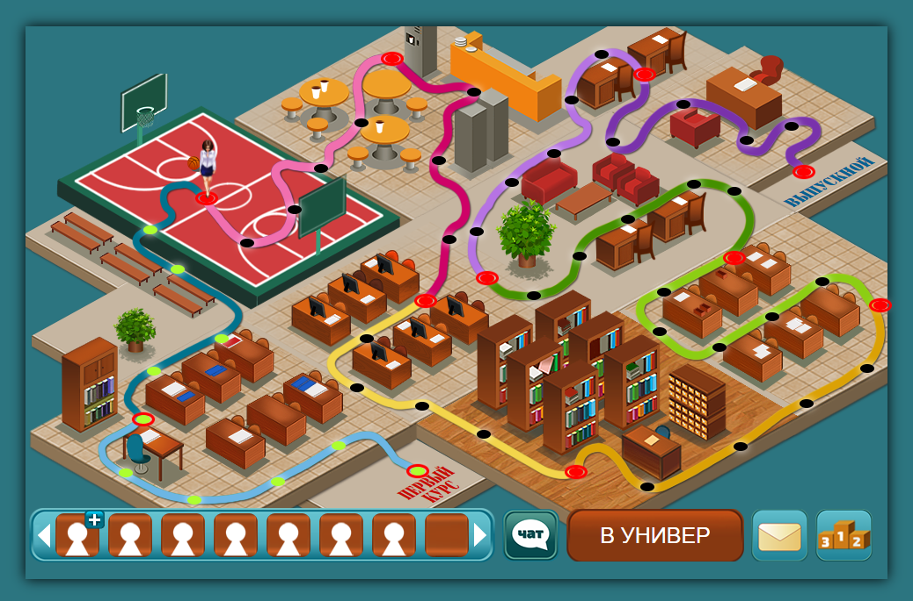

# Тестовое задание для ZEBOMBA games
 
ссылка на резюме: https://voronezh.hh.ru/resume/db80ce62ff07c1cfdd0039ed1f7a38707a716c
 
 
- в первой папке, находится проект, который просто запускается по клику на index.html
 
- во второй папке, находится проект, который запускается через любой live-server. Достаточно использовать VsCode, или WebStorm
 
 
# Что реализовано:
- Реализован герераток чекпоинтов, которые генерятся по длине пути svg.
- Достаточно любую карту(svg path) залить и можно динамически генерить чекпоинты и взаимодействовать с ними. Легко расширить до автоматических равных промежутков, между длинной пути.
- Реализован бесконечный слайдер и pop-up окна рейтинга
- Реализована базовая доступность всех интерактивных элементов для скринридеров и людей с ОВ.

# Не успел реализовать:
- прогрессивную деградацию
- Добавить градиенты, повторяющие картинки, pixel perfect
- поддержку ie
- mvc, или более-менее подходящую архитектуру
- перемещение персонажа по path использую request-animation и меняя transform, а не position. Но для этого 90% уже написано.
- слайдер в такой реализации не имеет анимации и дергает dom. Но тз по нему, не очень понятное. Можно переделать на свайпы.

# Затрачено времени:
- 17.07 8 часов: приступил в тестовому заданию
изучение path, кривых безье (хотел создать генератор линий и пути, но это слишком объёмная работа)
эксперементы с canvas, чтение статей, эксперементы с различными методами. Создание шаблона
- 18.07 8 часов: 
вёрстка слайдера, верстка остальных компонентов, работа pop-up
- 19.07 4 часа - разработка генератора и его интеграция
- 20.07 4 часа - доработка и небольшое тестирование приложения. Устранение мелких ошибок.

 

